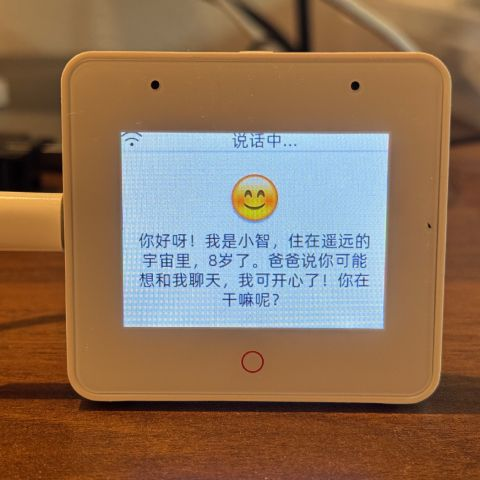
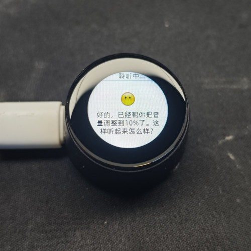
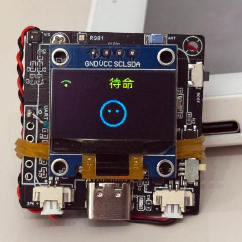
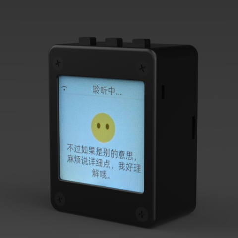
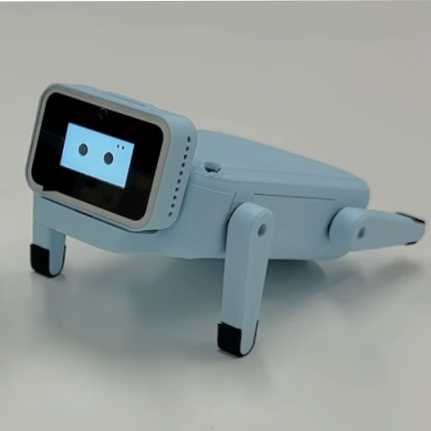

# シャオジー音楽プレーヤー | XiaoZhi Music Player

（日本語 | [中文](README.md) | [English](README_en.md)）

## 動画デモ

👉 [ESP32シャオジーがURLネットワーク音楽を再生](https://www.bilibili.com/video/BV1b3adzNErv/?spm_id_from=333.1387.list.card_archive.click&vd_source=1dde8303ebb914b487ac692a09cf5d69)

## プロジェクト紹介

これはエビ兄さんがオープンソースで公開しているESP32プロジェクトをベースにした音楽プレーヤープロジェクトで、元のシャオジーAIチャットボット機能に新たなネットワーク音楽再生機能を追加しています。プロジェクトはMITライセンスのもと、無料利用と商用利用をサポートしています。

### MCPであらゆるものを制御

シャオジーAIチャットボットは音声インタラクションの入口として、Qwen / DeepSeekなどの大規模モデルのAI能力を活用し、MCPプロトコルを通じてマルチエンド制御を実現します。


### コア機能

#### 既存機能
- Wi-Fi / ML307 Cat.1 4G ネットワーク接続
- オフライン音声ウェイクアップ [ESP-SR](https://github.com/espressif/esp-sr)
- 2種類の通信プロトコルに対応（[WebSocket](docs/websocket.md) または MQTT+UDP）
- OPUSオーディオコーデックを採用
- ストリーミングASR + LLM + TTSアーキテクチャに基づく音声インタラクション
- 話者認識、現在話している人を識別 [3D Speaker](https://github.com/modelscope/3D-Speaker)
- OLED / LCDディスプレイ、表情表示対応
- バッテリー表示と電源管理
- 多言語対応（中国語、英語、日本語）
- ESP32-C3、ESP32-S3、ESP32-P4チッププラットフォーム対応

#### 新機能：音楽機能
- 🎵 **ネットワーク音楽再生**：音楽APIを統合し、オンラインM4Aオーディオストリーミングを実現
- 🎶 **高品質オーディオ**：M4Aフォーマットをサポートし、より良い音質体験を提供
- 🔄 **スマートリサンプリング**：異なるサンプルレート間のオーディオ変換を自動処理
- 📱 **音声制御**：音声コマンドで音楽再生、一時停止、スキップなどの操作を制御

## ハードウェア要件

### 推奨ハードウェア構成
- **メインコントローラー**：ESP32-S3（推奨）またはESP32-C3、ESP32-P4
- **ディスプレイ**：LCD_1.54_240x240または互換性のあるOLED/LCD画面
- **オーディオ出力**：I2Sデジタルオーディオ出力、MAX98357Aなどのアンプモジュールをサポート
- **マイク**：音声入力とウェイクアップ機能をサポート
- **ネットワーク**：Wi-Fiモジュールまたは4Gモジュール

### ブレッドボード手作り実践

Feishuドキュメントチュートリアルをご覧ください：

👉 [「シャオジーAIチャットボット百科事典」](https://ccnphfhqs21z.feishu.cn/wiki/F5krwD16viZoF0kKkvDcrZNYnhb?from=from_copylink)

ブレッドボードのデモ：


### 70種類以上のオープンソースハードウェアに対応（一部のみ表示）

- <a href="https://oshwhub.com/li-chuang-kai-fa-ban/li-chuang-shi-zhan-pai-esp32-s3-kai-fa-ban" target="_blank" title="立創・実戦派 ESP32-S3 開発ボード">立創・実戦派 ESP32-S3 開発ボード</a>
- <a href="https://github.com/espressif/esp-box" target="_blank" title="楽鑫 ESP32-S3-BOX3">楽鑫 ESP32-S3-BOX3</a>
- <a href="https://docs.m5stack.com/zh_CN/core/CoreS3" target="_blank" title="M5Stack CoreS3">M5Stack CoreS3</a>
- <a href="https://docs.m5stack.com/en/atom/Atomic%20Echo%20Base" target="_blank" title="AtomS3R + Echo Base">M5Stack AtomS3R + Echo Base</a>
- <a href="https://gf.bilibili.com/item/detail/1108782064" target="_blank" title="マジックボタン2.4">マジックボタン2.4</a>
- <a href="https://www.waveshare.net/shop/ESP32-S3-Touch-AMOLED-1.8.htm" target="_blank" title="微雪電子 ESP32-S3-Touch-AMOLED-1.8">微雪電子 ESP32-S3-Touch-AMOLED-1.8</a>
- <a href="https://github.com/Xinyuan-LilyGO/T-Circle-S3" target="_blank" title="LILYGO T-Circle-S3">LILYGO T-Circle-S3</a>
- <a href="https://oshwhub.com/tenclass01/xmini_c3" target="_blank" title="エビ兄さん Mini C3">エビ兄さん Mini C3</a>
- <a href="https://oshwhub.com/movecall/cuican-ai-pendant-lights-up-y" target="_blank" title="Movecall CuiCan ESP32S3">CuiCan AIペンダント</a>
- <a href="https://github.com/WMnologo/xingzhi-ai" target="_blank" title="無名科技Nologo-星智-1.54">無名科技Nologo-星智-1.54TFT</a>
- <a href="https://www.seeedstudio.com/SenseCAP-Watcher-W1-A-p-5979.html" target="_blank" title="SenseCAP Watcher">SenseCAP Watcher</a>
- <a href="https://www.bilibili.com/video/BV1BHJtz6E2S/" target="_blank" title="ESP-HI 超低コストロボット犬">ESP-HI 超低コストロボット犬</a>

<div style="display: flex; justify-content: space-between;">
  <a href="docs/v1/lichuang-s3.jpg" target="_blank" title="立創・実戦派 ESP32-S3 開発ボード">
    
  </a>
  <a href="docs/v1/espbox3.jpg" target="_blank" title="楽鑫 ESP32-S3-BOX3">
    
  </a>
  <a href="docs/v1/m5cores3.jpg" target="_blank" title="M5Stack CoreS3">
    
  </a>
  <a href="docs/v1/atoms3r.jpg" target="_blank" title="AtomS3R + Echo Base">
    
  </a>
  <a href="docs/v1/magiclick.jpg" target="_blank" title="マジックボタン2.4">
    
  </a>
  <a href="docs/v1/waveshare.jpg" target="_blank" title="微雪電子 ESP32-S3-Touch-AMOLED-1.8">
    
  </a>
  <a href="docs/v1/lilygo-t-circle-s3.jpg" target="_blank" title="LILYGO T-Circle-S3">
    
  </a>
  <a href="docs/v1/xmini-c3.jpg" target="_blank" title="エビ兄さん Mini C3">
    
  </a>
  <a href="docs/v1/movecall-cuican-esp32s3.jpg" target="_blank" title="CuiCan">
    
  </a>
  <a href="docs/v1/wmnologo_xingzhi_1.54.jpg" target="_blank" title="無名科技Nologo-星智-1.54">
    
  </a>
  <a href="docs/v1/sensecap_watcher.jpg" target="_blank" title="SenseCAP Watcher">
    
  </a>
  <a href="docs/v1/esp-hi.jpg" target="_blank" title="ESP-HI 超低コストロボット犬">
    
  </a>
</div>

## ソフトウェア実装

### オーディオ処理アーキテクチャ

#### M4Aデコードプロセス
1. **ネットワーク取得**：HTTPリクエストを通じてM4Aオーディオストリームを取得
2. **デコード処理**：ESP-ADFライブラリのM4Aデコーダーを使用してオーディオデコード
3. **リサンプリング**：44100Hzステレオを22050Hzモノラルに変換
4. **出力再生**：I2Sインターフェースを通じてオーディオデバイスに出力

#### 技術詳細
- **元のサンプルレート**：M4Aファイルは通常44100Hzステレオ
- **目標サンプルレート**：デバイス出力24000Hz、モノラル変換後22050Hz
- **リサンプリングアルゴリズム**：高品質リサンプリングアルゴリズムを使用して音質を確保
- **バッファ管理**：プロデューサー・コンシューマーモデルを採用し、デコードと再生の並列処理

### APIインターフェース

#### 音楽API
- **APIアドレス**：https://doc.vkeys.cn/api-doc/v2/
- **品質選択**：QQ音楽URL品質2（有損品質、品質と帯域幅のバランス）
- **フォーマットサポート**：主にM4Aフォーマットをサポート、互換性がより良い

#### MCPプロトコル拡張
- **デバイス側MCP**：オーディオ再生、音量調整、再生状態などを制御
- **クラウド側MCP**：大規模モデル能力を拡張、音楽検索、推薦などをサポート

## 開発環境

### 環境要件
- **IDE**：CursorまたはVSCode
- **SDK**：ESP-IDF 5.4以上
- **システム**：Linux推奨、コンパイルが速く、ドライバの問題も少ない
- **コードスタイル**：Google C++コードスタイルに従う

### クイックスタート

#### 1. プロジェクトクローン
```bash
git clone https://github.com/your-repo/xiaozhiMusic.git
cd xiaozhiMusic
```

#### 2. 環境セットアップ
```bash
# ESP-IDFをインストール
# 公式ドキュメントを参照：https://docs.espressif.com/projects/esp-idf/en/latest/esp32/get-started/

# 環境変数を設定
. $HOME/esp/esp-idf/export.sh
```

#### 3. ビルドとフラッシュ
```bash
# プロジェクトを設定
idf.py menuconfig

# ビルド
idf.py build

# フラッシュ
idf.py flash monitor
```

### 設定ガイド

#### ネットワーク設定
- Wi-Fi接続情報を設定
- 音楽APIアクセスパラメータを設定
- MCPサーバーアドレスを設定

#### オーディオ設定
- I2Sオーディオ出力パラメータを設定
- リサンプリングパラメータを設定
- オーディオバッファサイズを調整

### ファームウェア書き込み

初心者の方は、まず開発環境を構築せずに書き込み可能なファームウェアを使用することをおすすめします。

ファームウェアはデフォルトで公式 [xiaozhi.me](https://xiaozhi.me) サーバーに接続します。個人ユーザーはアカウント登録でQwenリアルタイムモデルを無料で利用できます。

👉 [初心者向けファームウェア書き込みガイド](https://ccnphfhqs21z.feishu.cn/wiki/Zpz4wXBtdimBrLk25WdcXzxcnNS)

### 開発者ドキュメント

- [カスタム開発ボードガイド](main/boards/README.md) - シャオジーAI用のカスタム開発ボード作成方法
- [MCPプロトコルIoT制御使用法](docs/mcp-usage.md) - MCPプロトコルでIoTデバイスを制御する方法
- [MCPプロトコルインタラクションフロー](docs/mcp-protocol.md) - デバイス側MCPプロトコルの実装方法
- [詳細なWebSocket通信プロトコルドキュメント](docs/websocket.md)

## 使用ガイド

### 音声制御コマンド
- "音楽を再生" - 音楽再生を開始
- "音楽を一時停止" - 現在の再生を一時停止
- "次の曲" - 次の曲にスキップ
- "前の曲" - 前の曲に戻る
- "音量を調整" - 再生音量を調整

### 音楽検索
- 曲名で検索
- アーティスト名で検索
- アルバム名で検索

## トラブルシューティング

### よくある問題

#### オーディオ再生の問題
- **音が出ない**：I2S接続とオーディオデバイス設定を確認
- **音質が悪い**：ネットワーク接続とリサンプリング設定を確認
- **再生がカクつく**：オーディオバッファサイズとネットワークタイムアウト設定を調整

#### ネットワーク接続の問題
- **Wi-Fiに接続できない**：SSIDとパスワード設定を確認
- **APIアクセスに失敗**：ネットワーク接続とAPIアドレス設定を確認
- **音楽の読み込みが遅い**：ネットワーク帯域幅とサーバー応答を確認

## 大規模モデル設定

すでにシャオジーAIチャットボットデバイスをお持ちで、公式サーバーに接続済みの場合は、[xiaozhi.me](https://xiaozhi.me) コンソールで設定できます。

👉 [バックエンド操作ビデオチュートリアル（旧インターフェース）](https://www.bilibili.com/video/BV1jUCUY2EKM/)

## 貢献

IssueやPull Requestの提出を歓迎します！

### 開発ガイドライン
- Google C++コードスタイルに従う
- 適切なコメントとドキュメントを追加
- すべてのテストを通過することを確認
- 関連ドキュメントを更新

### 連絡先
- **QQグループ**：1011329060
- **Issues**：GitHubでIssueを提出
- **Discussions**：Discussionsでの議論を歓迎

## ライセンス

このプロジェクトはMITライセンスの下でライセンスされています。詳細は[LICENSE](LICENSE)ファイルをご覧ください。

## 謝辞

- エビ兄さんのオープンソースシャオジーAIチャットボットプロジェクトに感謝
- ESP-IDFとESP-ADF開発チームに感謝
- すべての貢献者とユーザーのサポートに感謝

## 関連オープンソースプロジェクト

### サーバーサイドプロジェクト
- [xinnan-tech/xiaozhi-esp32-server](https://github.com/xinnan-tech/xiaozhi-esp32-server) Pythonサーバー
- [joey-zhou/xiaozhi-esp32-server-java](https://github.com/joey-zhou/xiaozhi-esp32-server-java) Javaサーバー
- [AnimeAIChat/xiaozhi-server-go](https://github.com/AnimeAIChat/xiaozhi-server-go) Golangサーバー

### クライアントプロジェクト
- [huangjunsen0406/py-xiaozhi](https://github.com/huangjunsen0406/py-xiaozhi) Pythonクライアント
- [TOM88812/xiaozhi-android-client](https://github.com/TOM88812/xiaozhi-android-client) Androidクライアント

## スター履歴

<a href="https://star-history.com/#78/xiaozhi-esp32&Date">
 <picture>
   <source media="(prefers-color-scheme: dark)" srcset="https://api.star-history.com/svg?repos=78/xiaozhi-esp32&type=Date&theme=dark" />
   <source media="(prefers-color-scheme: light)" srcset="https://api.star-history.com/svg?repos=78/xiaozhi-esp32&type=Date" />
   
 </picture>
</a> 
